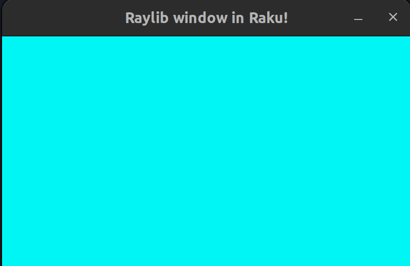
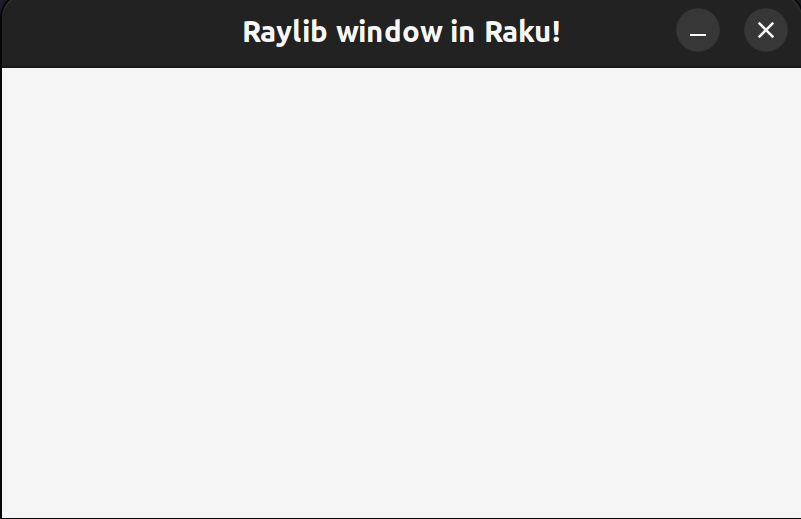

### Autogenerating Raku bindings!

#### Preface
For this advent post I will tell you about how I got into raku and my struggles of making raylib-raku bindings.

This post also contain stuff about C memory management which I didn't explain. I suggest learning a bit of C if interested.

#### Story time
I discovered Raku by sheer coincedence and got intrigued that it has first class support for grammars.
Trying out the grammar was very intuitive and easy, if you have ever tried using [EBNF](https://en.wikipedia.org/wiki/Extended_Backus%E2%80%93Naur_form) then it should feel similar.

I started on making a chip-8 emulator in raku and want [Raylib](https://github.com/raysan5/raylib) for rendering. Sadly nobody at the time have made any bindings for raku, and I think I know why.

So I began reading through the docs for creating the bindings using raku [nativecall](https://docs.raku.org/language/nativecall).
I began translating some simple functions in raylib.h to to raku nativecall, my first attempt was something like this:

```raku
use NativeCall;

constant LIBRAYLIB = 'libraylib.so';

class Color is export is repr('CStruct') is rw {
    has uint8 $.r;
    has uint8 $.g;
    has uint8 $.b;
    has uint8 $.a;
}

sub InitWindow(int32 $width, int32 $Height, Str $name) is native(LIBRAYLIB) { * }
sub WindowShouldClose(--> bool) is native(LIBRAYLIB) { * }
sub BeginDrawing() is native(LIBRAYLIB) { * }
sub EndDrawing() is native(LIBRAYLIB) { * }
sub CloseWindow() is native(LIBRAYLIB) { * }
sub ClearBackground(Color $color) is native(LIBRAYLIB) { * }

my $white = Color.new(r => 255,  g => 255,  b => 255,  a => 255);
InitWindow(800, 450, "Raylib window in Raku!");
while (!WindowShouldClose()) {
    BeginDrawing();
    ClearBackground($white);
    EndDrawing();
}
CloseWindow();

```
Yay we got a window!



But something is clearly off, the background wasn't white 
as I defined it to be.

I turns out that `ClearBackground` expects `Color` as value type as shown below:
```
RLAPI void ClearBackground(Color color);       
```

The problem is Raku only supports passing arguments as pointer!

After asking the community for guidens I got the solution which is to pointerize the function, meaning we need to make a new wrapper function example:   
`ClearBackground_pointerized(Color* color)` which takes Color as a pointer and then call the original function with the dereferenced value:

```c
void ClearBackground_pointerized(Color* color)
{
     ClearBackground(*color);
}
```
Since Color must be pointer we need to allocate it on the heap so we need be [malloc](https://en.wikipedia.org/wiki/C_dynamic_memory_allocation) Color.
We create a malloc function in c to be able to do this.

```c
Color* malloc_Color(unsigned char  r, unsigned char g, unsigned char b, unsigned char a) {
   Color* ptr = malloc(sizeof(Color));
   ptr->r = r;
   ptr->g = g;
   ptr->b = b;
   ptr->a = a;
   return ptr;
}
```
If you malloc you also need to free it, or else we get a memory leak.
so we make another function to free the Color.
```c
void free_Color(Color* ptr){
   free(ptr);
}
```

To make this more OO we supply the Color class with init method for mallocing it on the heap. 
and for automatically freeing we can use the submethod DESTROY, this kicks in whenever the GC decides to collect the resource, it will also free the memory.

```auto
class Color is export is repr('CStruct') is rw {
    has uint8 $.r;
    has uint8 $.g;
    has uint8 $.b;
    has uint8 $.a;
    method init(uint8 $r,uint8 $g,uint8 $b,uint8 $a) returns Color {
        malloc-Color($r,$g,$b,$a);
    }
    submethod DESTROY {
        free-Color(self);
    }
}
```

This intermediate C-code needs to also be compiled into the raylib library.

```
gcc -g -fPIC intermediate-code.c -lraylib -o modified/libraylib.so
```

Let's try again:

```
...
# using the modified libraylib.so
constant LIBRAYLIB = 'modified/libraylib.so';
...
# Not using init to malloc
my $white = Color.init(r => 255,  g => 255,  b => 255,  a => 255);
InitWindow(800, 450, "Raylib window in Raku!");
while (!WindowShouldClose()) {
    BeginDrawing();
    ClearBackground($white);
    EndDrawing();
}
CloseWindow();
```

Yes now it works as expected!



Phew!  
All this work needs to be done for every functions that takes a value type or returning a value type, That's many since pointerized functions when looking at [raylib.h](https://github.com/raysan5/raylib/blob/master/src/raylib.h).

I think that's why nobody has made bindings for raylib, because it's way too tedious!!!

At that point I almost didn't bother working on it.

Then I had a great idea! Raku has Grammar support! What if I just parse the header file and automatically generate the bindings using the actions.

This should be possible and so I began doing 

So I began defining the grammar for raylib keep in mind not for c, since that's a bigger task.


```raku
grammar RaylibGrammar {
    token TOP {
        [ <defined-content> ]*
    }

    rule defined-content {
        | <macro-block>
        | <closing-bracket>
        | <typedef>
        | <function>
        | <include>
        | <define-decl>
        | <statement>
    }

    rule macro-block {
        | <extern>
        | <if-macro-block>
        | <ifndef-block>
        | <else-macro-line>
        | <elif-macro-line>
        | <error-macro-line>
    }

    rule typedef-ignored {
        'typedef' 'enum' 'bool' <block> 'bool' ';'
    }

    rule extern {
        'extern' <string> '{'
    }

    token closing-bracket {
        '}'
    }

    rule if-macro-block {
        '#if' \N* \n? <defined-content>* '#endif'
    }

    rule ifndef-block {
        '#ifndef' <identifier> <defined-content>* '#endif'
    }
    rule error-macro-line {
        '#error' \N* \n?
    }
    rule else-macro-line {
        '#else' \n?
    }

    rule elif-macro-line {
        '#elif' \N* \n?
    }

    rule include {
        '#include' '<' ~ '>' [ <identifier> '.h' | <string> ]
    }

    rule if-defined {
        '#if' \N* \n?
    }

    rule elif-defined {
        '#elif' '!'? 'defined' '(' .* ')' <defined-content>* <endif>
    }

    token elif {
        '#elif'
    }

    token endif {
        '#endif'
    }

    rule statement {
        | <comment>
        | <var-decl>
        | <enum-var-decl>
    }

    rule block {
        '{' ~ '}' <statement>*
    }

    rule function {
        <api-decl>? <type> <pointer>* <identifier> '(' ~ ')' <parameters>? ';'
    }

    rule parameters {
        | '...'
        | <const>? <unsigned>? <type> <pointer>* <identifier>? [',' <parameters>]*
    }

    ...

}
```

The full [raylib grammar](https://github.com/vushu/raylib-raku/blob/main/lib/Raylib/Grammar.rakumod)

The action just has arrays of string for generating the raku bindings and the C-intermediate code.

We just needed to make some cases for handling pointerization here is a simplified pointerization logic inside raylib-raku.

We need to pointerize a function if type is an identifier and has no pointer, by having this condition
we deduce that the function returns a value type.
Using raku multiple dispatch is a very clean way to handle this scenario.

Below is a very simplified example of what I do to generate pointerized function I do not guarantee that the code works :D

```
multi method function($/ where $<type><identifier> && !$<pointer>) {
    my $return-type = ~$<type>;
    my $function-name = ~$<identifier>;
    my @current-identifiers;

    # pointerizing the parameters which also extracts the identifiers inside the parameters
    my $pointerized-params = self.pointerize-parameters($<parameters>, @current-identifiers);

    # then we use the current-identifiers for creating the call to the original c-function
    my $original-c-function = self.create-call-func(@current-identifiers, $<identifier>);

    # creating the c-wrapper function;
    my $wrapper = "$return-type $function-name_pointerized ($pointerized_parameters) \{ 
        return $original-c-function;
    \}";

    # when calling .made we convert it to raku types
    my $raku-func = "our sub $function-name $<parameters>.made $<type>.made is export is native(LIBRAYLIB) is symbol('$function-name_pointerized') \l{ * \}";

    @pointerized-bindings.push($wrapper);
    @raku-bindings.push($raku-func);
}

# defined map for c to raku types
has @.type-map = "int" => "int32", "float" => "num32", "double" => "num64", "short" => "int16", "char"  => "Str", "bool" => "bool", "void" => "void", "va_list" => "Str";

method type($/) {
    if ($<identifier>) {
        make ~$<identifier>;
    }
    else {
        # translating c type to raku type
        make %.type-map{~$/};
    }
}

method create-call-func(@current-identifiers, $identifier) {
        my $call-func = $identifier ~ '(';
        for @current-identifiers.kv -> $idx, $ident {
            my $add-comma = $idx gt 0 ?? ', ' !! '';
            # need to deref True of False?
            if ($ident[2]) {
                $call-func ~= ($add-comma ~ "*$ident[1]");
            }
            else {
                $call-func ~= ($add-comma ~ "$ident[1]");
            }
        }
        $call-func ~= ");";
        return $call-func;
}

# Creating pointerized parameters
method pointerize-parameters($parameters, @current-identifiers) {
        my $tail = "";
        # recursively calling pointerize-parameters on the rest 
        my $rest = $parameters<parameters> ?? $parameters<parameters>.map(-> $p {self.pointerize-parameters($p, @current-identifiers)}) !! "";
        if $rest {
            $tail = ',' ~ ' ' ~ $rest;
        }

        # if is value type do pointerization
        if ($parameters<type><identifier> && !$parameters<pointer>) {
            return "$($parameters<type>)* $parameters<identifier>" ~ $tail;
        }
        else {
            return "$($parameters<type>) $parameters<identifier>" ~ $tail;
        }
}

# made function for parameters turning them to raku types
multi method parameters($/ where $<pointer> && $<type> eq 'void') {
    make "Pointer[void] \$$<identifier>, {$<parameters>.map: *.made.join(',')}";
}

multi method parameters($/ where $<pointer> && $<type> eq 'int') {
    make "int32 \$$<identifier> is rw, {$<parameters>.map: *.made.join(',')}";
}

multi method parameters($/ where $<pointer> && $<type> eq 'char' && !$<const>) {
    make "CArray[uint8] \$$<identifier>, {$<parameters>.map: *.made.join(',')}";
}
...

```

The code above demonstrate how we use the grammar and action to deduce the code generatiing pointerized c-functions which was the most problematic case.

Ofcourse we also need to generate make allocation function function, callbacks, const, unsigned int. I left those out since the post will be way to long to describe those.

I took me about a week to finish the code generation logic.

Generated raku bindings [raku-bindings](https://github.com/vushu/raylib-raku/blob/main/lib/Raylib/Bindings.rakumod)
Generated c-intermediate code [pointerized-functions](https://github.com/vushu/raylib-raku/blob/main/resources/raylib_pointerized_wrapper.c)

#### Conclusion

By using grammar and actions we successfully made raylib available for raku 
I took the liberty to add raku on the list of raylib bindings https://github.com/raysan5/raylib/blob/master/BINDINGS.md
All in all it was an success visit https://github.com/vushu/raylib-raku if curious about the module.


