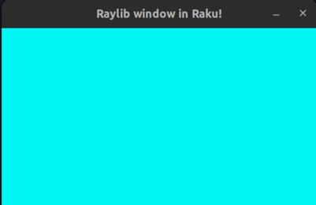

### Autogenerating Raku bindings!

For this advent post I will tell you about how I got into raku and my journey and struggles into making raku bindings.

This post also has some talks about C value types and pointer type, which I didn't go much deep into.

I discovered Raku by sheer coincedence and got intrigued that it has first class support for grammars.
Trying out the grammar was very intuitive and easy, if you have ever tried using [EBNF](https://en.wikipedia.org/wiki/Extended_Backus%E2%80%93Naur_form) then you should feel right at home.

My goal is to make a chip-8 emulator in raku and want [Raylib](https://github.com/raysan5/raylib) for rendering. Sadly nobody at the time have made any bindings for raku, and I suspect I know why later on.

So I began reading through the docs for creating the bindings using raku [nativecall](https://docs.raku.org/language/nativecall).
It was slowly but steadily I translated raylib.h to to nativecall, my first attempt was something like this:

```
use NativeCall;

constant LIBRAYLIB = 'libraylib.so';

class Color is export is repr('CStruct') is rw {
    has uint8 $.r;
    has uint8 $.g;
    has uint8 $.b;
    has uint8 $.a;
}

sub InitWindow(int32 $width, int32 $Height, Str $name) is native(LIBRAYLIB) { * }
sub WindowShouldClose(--> bool) is native(LIBRAYLIB) { * }
sub BeginDrawing() is native(LIBRAYLIB) { * }
sub EndDrawing() is native(LIBRAYLIB) { * }
sub CloseWindow() is native(LIBRAYLIB) { * }
sub ClearBackground(Color $color) is native(LIBRAYLIB) { * }

my $white = Color.new(r=>255,  g=>255,  b=>255,  a=>255);
InitWindow(800, 450, "Raylib window in Raku!");
while (!WindowShouldClose()) {
    BeginDrawing();
    ClearBackground($white);
    EndDrawing();
}
CloseWindow();

```


But something is totally off, the background wasn't white at all!

I turns out that `ClearBackground` expects `Color` as value type.
as shown below:
```
RLAPI void ClearBackground(Color color);       
```

But Raku only supports passing arguments as pointer types!

The answer is to pointerize the function, meaning we need to make a new wrapper function `ClearBackground_pointerized(Color* color)` which takes Color as a pointer and call the original function with the dereferenced value.

```
void ClearBackground_pointerized(Color* color){ ClearBackground(*color); }
```
this intermediate C-code need to also be compiled into the raylib library.

But now we also need to be able malloc Color since we need it as a pointer.

```
Color* malloc_Color(unsigned char  r, unsigned char g, unsigned char b, unsigned char a) {
   Color* ptr = malloc(sizeof(Color));
   ptr->r = r;
   ptr->g = g;
   ptr->b = b;
   ptr->a = a;
   return ptr;
}
```
If you malloc you also need to free it, or else we get a memory leak.
```
void free_Color(Color* ptr){
   free(ptr);
}
```

this intermediate C-code needs to also be compiled into the raylib library.

All work needs to be done for every struct and functions that takes a value type and returning a value type!

This task of creating the bindings just exploded in complexity!

To make this more OO we suply the Color class with init method for mallocing and for automatically freeing we can use the submethod DESTROY, this kicks in whenever the GC decides to collect the resource, it will also free the memory.

```
class Color is export is repr('CStruct') is rw {
    has uint8 $.r;
    has uint8 $.g;
    has uint8 $.b;
    has uint8 $.a;
    method init(uint8 $r,uint8 $g,uint8 $b,uint8 $a) returns Color {
        malloc-Color($r,$g,$b,$a);
    }
    submethod DESTROY {
        free-Color(self);
    }
}
```

Compiling the C-intermediate code into our library we finally make the background white.

```
gcc -g -fPIC intermediate-code.c -lraylib -o modified/libraylib.so
```


Now I understand why nobody has made bindings for raylib, because it's way too tedious!!!

I almost gave up since this was way too much work, but then I remembered Raku has Grammar support, 
What if I just parse the header file and automatically make the bindings, meaning generating pointerized, allocation functions and generating raku bindings all this according to the c-types.

This I began doing!
